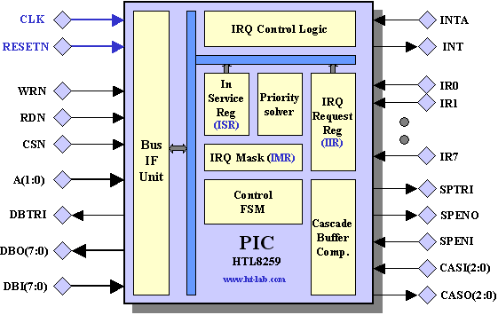
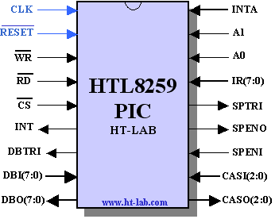

# HTL8259 an 8259 Compatible PIC IP core


<p align="center">

</p>


## 1. Introduction

The HTL8259 is a synchronous implementation of the industry standard 8259/8259A Programmable Interrupt Controller (PIC). The PIC can be used to extend the numberof interrupt lines on a microcontroller/processor.

The HTL8259 provide a wide range of vectored interrupt handling and termination modes. The controller can be programmed for fixed, priority and polled mode of operation. Interrupt inputs can either be level or edge triggered. A single HTL8259 controller can handle up to 8 vectored priority interrupts. Without any glue logic multiple HTL8259 can be cascaded to provide upto 64 vectored priority interrupts. This number can be further increased by using the Poll command.

There are no software differences between the HTL8259 and a VLSI 8259 device. For this reason no programming information is provided in this document. Any commercial 8259/8259a datasheet can be used to obtain this information.

## 2. Directory Structure

The directory structure is as follows:


| **Directory**     | **Contents**                                            |
| ----------------- | ------------------------------------------------------- |
| HTL8259\doc       | Documentation and Datasheets                            |
| HTL8259\rtl       | Synthesizable IP Core                                   |
| HTL8259\testbench | Testbench files                                         |
| HTL8259\Modelsim  | Example script for Modelsim Simulator                   |
| HTL8259\synthesis | Synthesis scripts                                       |


## 3. Filelist


The HTL8259 RTL design is contained in 7 VHDL files.

| **Filename**      | **Contains**                                |
| ----------------- | ------------------------------------------- |
| pulselevel.vhd    | Interrupt input logic                       |
| frontend_rtl.vhd | Interrupt Register, level/trigger selection |
| priority_rtl.vhd | Interrupt Priority logic                    |
| backend_rtl.vhd  | Interrupt Service logic                     |
| wrctrl.vhd        | Register logic and control                  |
| ctrl.vhd          | Control FSM                                 |
| htl8259a.vhd      | Top Level                                   |


A further 3 files are used for the testbench.


| **Filename**        | **Contains**                                          |
| ------------------- | ----------------------------------------------------- |
| htl8259_tester.vhd | Testbench Stimulus module                             |
| utils.vhd           | Support utilities                                     |
| htl8259_tb.vhd     | Testbench, instantiates the HTL8259 and tester module |


## 4. Pin Description





| **Symbol** | ## Type | **Function**                                                |
| ---------- | ------- | ----------------------------------------------------------- |
| CLK        | I       | Clock Input signal **<sup>Note1</sup>**                     |
| RESET      | I       | Active Low Reset signal                                     |
| WR         | I       | Active Low Write Strobe                                     |
| RD         | I       | Active Low Read Strobe                                      |
| CS         | I       | Active Low Chip Select signal                               |
| A0/A1      | I       | 2 bits Address Bus                                          |
| DBI(7:0)   | I       | 8-bits DataBus Input                                        |
| DBO(7:0)   | O       | 8-bits DataBus Output                                       |
| DBTRI      | O       | DataBus Tri-State Signal, Active High drives the output bus |
| INT        | O       | Interrupt Output signal to processor                        |
| INTA       | I       | Interrupt Acknowledge signal from processor                 |
| IR(7:0)    | I       | Interrupt input signals                                     |
| SPENI      | I       | SP/EN Input signal                                          |
| SPENO      | O       | SP/EN Output signal                                         |
| SPTRI      | O       | SP/EN Tri-State signal, Active High drives the output bus   |
| CASI(2:0)  | I       | 3-bits CAS input bus                                        |
| CASO(2:0)  | O       | 3-bits CAS output bus                                       |


**Note1**: All actions are on the Rising Edge of the system clock.


## 5. Simulation


The HTL8259 IP core is written in vendor neutral VHDL and as such can be simulated by any modern simulation tool.

The testbench instantiates the htl8259 together with a stimulus generation file.

To run the simulation, execute the **simulation\run.bat** batch file from a CMD/Dosbox prompt. An equivalent Modelsim **run.do** file can be executed from within the Modelsim\Questa GUI.

Note that part of the validation was performed in software (8086 assembly language).

Part of the testbench output is shown below. See expected_output.txt in the simulation directory for the full listing.


```
#  run -all
# ------- Test Spurious Interrupt --------
# *** Request   IRm=00 ISm=00 MKm=00  IRs=00 ISs=00 MKs=00  -> 8086 INTA :IRQ7 Vector 47
# ------- Test Non-Specific Interrupt --------
# *** Request  IRQ3 IRQ6  IRm=48 ISm=00 MKm=00  IRs=00 ISs=00 MKs=00  -> 8086 INTA :IRQ3 Vector 43
# *** Request  IRQ3 IRQ6  IRm=48 ISm=00 MKm=00  IRs=00 ISs=00 MKs=00  -> 8086 INTA :IRQ3 Vector 43
# --- Test Non-Specific Interrupt + Rotate ----
# *** Request  IRQ3 IRQ6  IRm=48 ISm=00 MKm=00  IRs=00 ISs=00 MKs=00  -> 8086 INTA :IRQ3 Vector 43
# *** Request  IRQ3 IRQ6  IRm=48 ISm=00 MKm=00  IRs=00 ISs=00 MKs=00  -> 8086 INTA :IRQ6 Vector 46
# *** Request  IRQ3 IRQ6  IRm=48 ISm=00 MKm=00  IRs=00 ISs=00 MKs=00  -> 8086 INTA :IRQ3 Vector 43
# ------- Test Spurious Interrupt after rotate --------
# *** Request   IRm=00 ISm=00 MKm=00  IRs=00 ISs=00 MKs=00  -> 8086 INTA :IRQ7 Vector 47
# --- Test Specific Interrupt ----
# *** Request  IRQ3 IRQ6  IRm=48 ISm=00 MKm=00  IRs=00 ISs=00 MKs=00  -> 8086 INTA :IRQ3 Vector 43
# *** Request  IRQ3 IRQ6  IRm=48 ISm=00 MKm=00  IRs=00 ISs=00 MKs=00  -> 8086 INTA :IRQ3 Vector 43
# --- Test Specific Interrupt + Rotate----
...
...
# ------- Test Poll Command --------
#   Interrupt Pending : 81 ISmaster=02
# ------- Test 8080/8085 mode, interval 4 -------
# *** Request  IRQ0 IRQ1 IRQ3 IRQ4 IRQ5 IRQ6 IRQ7  IRm=FB ISm=00 MKm=00  IRs=00 ISs=00 MKs=00  -> 8080 INTA :CD 20 3B
# *** Request  IRQ0 IRQ1 IRQ3 IRQ4 IRQ5 IRQ6 IRQ7  IRm=FA ISm=00 MKm=00  IRs=00 ISs=00 MKs=00  -> 8080 INTA :CD 24 3B
# *** Request  IRQ0 IRQ1 IRQ3 IRQ4 IRQ5 IRQ6 IRQ7  IRm=F8 ISm=00 MKm=00  IRs=00 ISs=00 MKs=00  -> 8080 INTA :CD 2C 3B
# *** Request  IRQ0 IRQ1 IRQ3 IRQ4 IRQ5 IRQ6 IRQ7  IRm=F0 ISm=00 MKm=00  IRs=00 ISs=00 MKs=00  -> 8080 INTA :CD 30 3B
# *** Request  IRQ0 IRQ1 IRQ3 IRQ4 IRQ5 IRQ6 IRQ7  IRm=E0 ISm=00 MKm=00  IRs=00 ISs=00 MKs=00  -> 8080 INTA :CD 34 3B
# *** Request  IRQ0 IRQ1 IRQ3 IRQ4 IRQ5 IRQ6 IRQ7  IRm=C0 ISm=00 MKm=00  IRs=00 ISs=00 MKs=00  -> 8080 INTA :CD 38 3B
# *** Request  IRQ0 IRQ1 IRQ3 IRQ4 IRQ5 IRQ6 IRQ7  IRm=80 ISm=00 MKm=00  IRs=00 ISs=00 MKs=00  -> 8080 INTA :CD 3C 3B
# ------- Test 8080/8085 mode, interval 8 -------
# *** Request  IRQ0 IRQ1 IRQ3 IRQ4 IRQ5 IRQ6 IRQ7  IRm=FB ISm=00 MKm=00  IRs=00 ISs=00 MKs=00  -> 8080 INTA :CD 40 2A
# *** Request  IRQ0 IRQ1 IRQ3 IRQ4 IRQ5 IRQ6 IRQ7  IRm=FA ISm=00 MKm=00  IRs=00 ISs=00 MKs=00  -> 8080 INTA :CD 48 2A
# *** Request  IRQ0 IRQ1 IRQ3 IRQ4 IRQ5 IRQ6 IRQ7  IRm=F8 ISm=00 MKm=00  IRs=00 ISs=00 MKs=00  -> 8080 INTA :CD 58 2A
# *** Request  IRQ0 IRQ1 IRQ3 IRQ4 IRQ5 IRQ6 IRQ7  IRm=F0 ISm=00 MKm=00  IRs=00 ISs=00 MKs=00  -> 8080 INTA :CD 60 2A
# *** Request  IRQ0 IRQ1 IRQ3 IRQ4 IRQ5 IRQ6 IRQ7  IRm=E0 ISm=00 MKm=00  IRs=00 ISs=00 MKs=00  -> 8080 INTA :CD 68 2A
# *** Request  IRQ0 IRQ1 IRQ3 IRQ4 IRQ5 IRQ6 IRQ7  IRm=C0 ISm=00 MKm=00  IRs=00 ISs=00 MKs=00  -> 8080 INTA :CD 70 2A
# *** Request  IRQ0 IRQ1 IRQ3 IRQ4 IRQ5 IRQ6 IRQ7  IRm=80 ISm=00 MKm=00  IRs=00 ISs=00 MKs=00  -> 8080 INTA :CD 78 2A
# ** Failure: end of simulation
#    Time: 360760 ns  Iteration: 0  Process: /htl8259_tb/U_1/line__62 File: ../testbench/htl8259_tester.vhd
# Break in Process line__62 at ../testbench/htl8259_tester.vhd line 1453
# Stopped at ../testbench/htl8259_tester.vhd line 1453
```

## 6. Synthesis

The HTL8259 can be synthesized using any modern synthesis tool. An in order file list is provided in the synthesis directory.


## 7. History


| **Version** | **Date** | **Changes**                    |
| ----------- | -------- | ------------------------------ |
| 1.0         | 27/07/02 | First Version                  |
| 1.0a        | 22/11/09 | Tools Update Check             |
| 1.2         | 21/11/23 | Cleaned and uploaded to github |


## 8. License

See the LICENSE file for details.

## Trademarks

ModelSim®, Questa, QuestaSim and their respective logos are trademarks or registered trademarks of Siemens Industry Software Limited. All other trademarks are the property of their respective owners.

